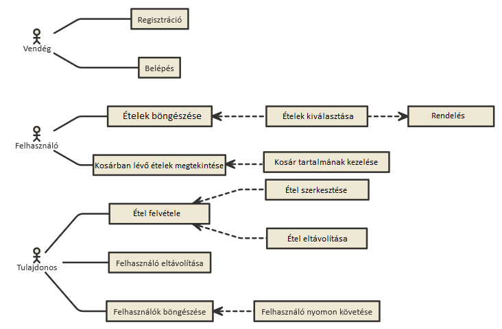

 # :spaghetti: Ételrendelés

:car: A program egy étel-futár vállalat rendeléseket kezelő rendszer.

:incoming_envelope: A megrendeléseket a vásárlók a webes felületen keresztül adhatják le. 
### Funkcionális követelmények:
- A weblap főoldalán megjelennek a kategóriák (pl. levesek, pizzák, üdítők), valamint a 10 legnépszerűbb (legtöbbet rendelt) étel/ital.
- A kategóriát kiválasztva listázódnak a tételek (név és ár kíséretében), amelyek szűrhetőek név(részlet)re. Ételek esetén leírás is van. Külön meg vannak jelölve a csípős, illetve vegetáriánus ételek.
- Ételek és italok tetszőleges számban helyezhetőeka kosárba egy adott felső korlátig  (20.000 Ft), afelett több terméket nem lehet a kosárba helyezni. 
- A kosár tartalma bármikor megtekinthető, ekkor látszódnak a felvett tételek, illetve látható az összár.Bármely tétel kivehető a kosárból.
- A rendelést törölhetjük, illetve leadhatjuk. Utóbbi esetben meg kell adnunk a nevünket, címünket, illetve telefonszámunkat, majd elküldhetjük a rendelést.nA grafikus felületet az alkalmazottak használják a rendelések, illetve a weblap tartalmának adminisztrálására.
- Az alkalmazott bejelentkezhet (felhasználónév és jelszó megadásával) a programba, illetve kijelentkezhet.
- Bejelentkezve listázódnak a leadott, illetve teljesített rendeléseket (leadás időpontja,  teljesítés  időpontja,  név,  cím,  telefonszám,  összeg),  egy rendelést kiválasztva pedig listázódnaka tételeket. A leadott rendelés teljesítettnek jelölhető, ekkor a rendszer rögzíti a teljesítés időpontját is. A lista szűrhető csak teljesített, illetve csak leadott rendelésekre, továbbá a rendelő nevére, illetve cím(részlet)re.
- Lehetőség van új étel, illetve ital hozzáadására (név, ár, illetve étel esetén leírás, csípős/vegetáriánus tulajdonságok megadásával). Az egyértelműség miatt nem engedélyezett több ugyanolyan nevű étel/ital felvitele.
### Nem funkcionális követelmények:
- Felhasználóbarát, minimalista felület
- Autentikációval védett funkciók
- Optimalizáció külöböző böngészőkre
- Reszponzív felület

## :chart_with_downwards_trend: Az adatbázis az alábbi adatokat tárolja:
- kategóriák (név);
- ételek és italok(név, kategória, leírás, ár, csípős-e,  vegetáriánus-e);
- munkatársak (teljes név, felhasználónév, jelszó);
- rendelések (név, cím, telefonszám, megrendelt ételek és italok, teljesített-e)

## Használatieset - modell
Szerepek :information_desk_person:
- Vásárló (regisztrált felhasználó? kell neki regisztrálnia?)
- Tulajdonos
# 

## Végpontok
- GET / Főoldal
- POST /register Regisztrálás
- POST /login Bejelentkezés

- GET /employees Dolgozók adatai
- GET /employees/:id Adott dolgozó adata
- POST /employees/:id Új dolgozó felvitele
- PUT /employees/:id Az adott id-val rendelkező dolgozó adatainak frissítése
- DELETE /employees/:id Adott id-val rendelkező dolgozó törlése 
- GET /employees/purchases Listázódnak a dolgozók belépésekor a rendelések
- GET /employees/purchases/delivered Listázódnak a kiszállított rendelések
- GET /employees/purchases/notDelivered Listázódnak a nem kiszállított rendelések

- GET /categories Az összes kategória 
- GET /categories/:id Adott kategória
- POST /categories Új kategória felvitele
- PUT /categories/:id Adott id-val rendelkező kategória módosítása
- DELETE /categories/:id Adott id-val rendelkező kategória törlése

- GET /products Az összes termék
- GET /products/:id Adott termék 
- POST /products Új termék felvétele
- PUT /products/:id Adott id-val rendelkező termék módosítása
- DELETE /products/:id Adott id-val rendelkező termék törlése

- GET /purchases Az összes rendelés
- GET /purchases/:id Adott rendelés
- POST /purchases Új rendelés felvitele
- PUT /purchases/:id Adott termék módosítása a kosárban
- DELETE /purchases/:id Adott termék törlése a kosárból
